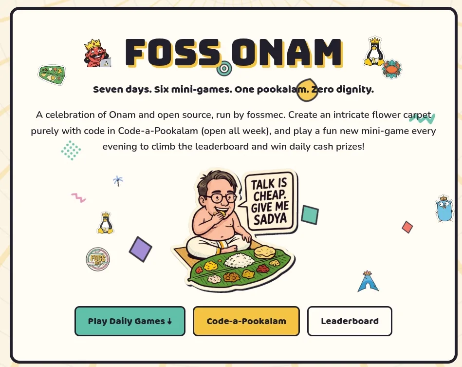

# Onam Games

> Seven days of browser mini-games, an algorithmic pookalam contest, and a
> community flower carpet — an open-source festival built by **FOSS MEC**.



Onam Games began as the natural next step for FOSS MEC's annual
**Code-a-Pookalam** competition: instead of one contest, a whole festival week.
A new mini-game unlocks each day, Code-a-Pookalam runs all week, and everyone
draws on a shared pookalam canvas in real time.

The gameplay is fully server-verified. Puzzles are generated from a seed that
never leaves the backend, scores and durations are recomputed on submit, and the
answer key is only ever revealed after you have finished a game yourself.

## Features

- **Six daily mini-games** — a fresh challenge every day of the festival:
  - **Open Source Tinder** — swipe left or right on open-source projects.
  - **Pookalam Jigsaw** — reassemble a flower carpet from its pieces.
  - **sudoWend** — a word hunt that requires root permissions.
  - **BoatLock** — slide the chundan vallam out of a very bureaucratic traffic jam.
  - **Maveli Jump** — climb from Paathalam to Kerala with physics you can feel.
  - **The Hunt** — unearth legendary Linux relics hidden across the realm.
- **Code-a-Pookalam** — draw a pookalam purely with code, judged by the community
  in anonymous 1v1 ELO rounds (Bradley–Terry maximum likelihood).
- **Live community pookalam** — a real-time collaborative canvas where anyone can
  place flower petals and leave Onam wishes.
- **Fair-play leaderboards** — daily boards ranked in each game's own units
  (fastest time, highest score, first correct submission), with server-side
  verification and device-level anti-abuse.
- **Streaks, gifts, letters, comics and more** — festival extras sprinkled
  through the routes under `src/routes/`.
- **Open-to-all mode** — flip one environment variable and the scheduled event
  becomes a public playground: every game live at all times, name-only sign-up,
  no Google account required. See [below](#open-to-all-mode).

## Tech stack

| Layer      | Choice                                                                                        |
| ---------- | --------------------------------------------------------------------------------------------- |
| Framework  | [SolidStart](https://start.solidjs.com) (SolidJS) with server functions and API routes        |
| Toolchain  | [Vite+](https://viteplus.dev) (`vp`) — Vite, Rolldown, Vitest, Oxlint, Oxfmt and Vite Task    |
| Server     | [Nitro](https://nitro.build) presets (Node, Vercel and Cloudflare Workers)                    |
| Styling    | [Tailwind CSS v4](https://tailwindcss.com) plus hand-rolled CSS in `src/app.css`              |
| Database   | Postgres via [Drizzle](https://orm.drizzle.team) and the `postgres` driver                    |
| Auth       | Supabase Auth (Google OAuth) with an encrypted HttpOnly session cookie                        |
| Storage    | Supabase Storage (public `avatars` and `pookalams` buckets)                                   |
| Anti-abuse | Device fingerprinting, rate limiting, plausibility checks and server-side replay verification |

## Repository layout

```
src/
  routes/             file-based routes: games, leaderboard, code-a-pookalam, admin, api/…
  components/         UI, grouped by feature (games, pookalam, leaderboard, admin, art…)
  server/             server-only code, called from actions and API routes
    auth/             sessions, Google OAuth, onboarding, bans, guest accounts
    games/            game registry, schedule, attempts, verification, implementations
    leaderboard/      daily boards and standings
    pookalam/         Code-a-Pookalam contest and voting
    anti-cheat/       device binding, rate limits, anomaly logging
    settings/         runtime app settings (schedule, phases, toggles)
  lib/                shared helpers and static content
drizzle/              generated SQL migrations
scripts/              seeding, maintenance and analysis scripts
```

## Getting started

### Prerequisites

- Node.js **20+**
- [pnpm](https://pnpm.io)
- The `vp` CLI (Vite+)
- A Postgres database — the free tier of [Supabase](https://supabase.com) works
  well; a local `supabase start` stack does too

### 1. Install

```bash
vp install
```

### 2. Configure

```bash
cp .env.example .env
```

Fill in the values you need — the full list is in
[Environment variables](#environment-variables) and [SETUP.md](./SETUP.md). For a
quick local run against a Supabase stack, the defaults in `.env.example` are the
right shape.

### 3. Migrate and seed

```bash
vp run db:migrate        # apply drizzle/*
vp run db:seed           # insert the games and defaults
```

### 4. Develop

```bash
vp dev
```

The app is now on <http://localhost:3000>. Auth flow:
`/auth/signin` → Google → `/auth/callback` → session cookie → `/onboarding`
(college / branch / batch / division) → home.

### 5. Build and deploy

```bash
vp build
```

The output lands under `.output/`. Nitro presets cover Node (`node .output/server/index.mjs`),
Vercel and Cloudflare Workers/Pages — see `render.yaml`, `vercel.json` and
`wrangler.toml`.

## Environment variables

| Variable                     | Purpose                                                                        |
| ---------------------------- | ------------------------------------------------------------------------------ |
| `DATABASE_URL`               | Postgres connection string (pooled)                                            |
| `SUPABASE_URL`               | Supabase project URL                                                           |
| `SUPABASE_ANON_KEY`          | Public anon key                                                                |
| `SUPABASE_SERVICE_ROLE_KEY`  | Service-role key — server only, keep secret                                    |
| `SESSION_SECRET`             | Session cookie signing key (`openssl rand -base64 32`)                         |
| `DEVICE_PEPPER`              | Pepper for device fingerprint hashes (`openssl rand -base64 32`)               |
| `GOOGLE_OAUTH_CLIENT_ID`     | Optional direct Google sign-in (nicer consent screen)                          |
| `GOOGLE_OAUTH_CLIENT_SECRET` | Optional direct Google sign-in secret                                          |
| `AUTH_ORIGIN`                | Public origin used to build the OAuth redirect                                 |
| `VITE_SITE_URL`              | Canonical site origin (og:url, sitemap, canonical links)                       |
| `OPEN_TO_ALL`                | `true` runs the open playground instead of the scheduled festival              |
| `VITE_*`                     | Client-exposed analytics and site configuration (Umami, Clarity, verification) |

## Open-to-all mode

The festival normally runs on a clock: closed beta, one game a day, and Google
sign-in so a result belongs to a real person. Set:

```dotenv
OPEN_TO_ALL=true
```

and the site becomes a public playground instead:

- **Every published game is live at all times.** The schedule clock is switched
  off, so there are no countdowns and no "after deadline" results that silently
  miss the board.
- **The closed-beta door is lifted** for everyone, signed in or not.
- **Sign-up is just a name.** `/auth/signin` shows a single name field; there is
  no Google account, no profile form and no onboarding. The name lives in a
  cookie on that device, so returning players keep their runs.
- **Two leaderboards, one toggle.** The default board shows only the name-only
  players from today, so a database carried over from the scheduled event does
  not bury the live standings under history. The **Event** toggle beside it
  switches to the real accounts from the scheduled event instead — the actual
  participants and winners. The toggle only appears in open mode; outside it,
  the two are the same board.
- **Organisers can still sign in.** A small "Organiser / tester? Sign in with
  Google" link under the name form runs the normal Google flow, so an `admin` or
  `tester` account keeps its role and its `/admin` panel. Players will not
  notice it; staff will.

It is a server-side variable on purpose: the client learns the mode from the
server, so a stale build can never disagree with the code that enforces it.
Turning the flag back off restores the scheduled event — no migration, no
redeploy of anything else.

## Scripts

Run package scripts with `vp run <name>` (plain `vp <name>` runs a built-in Vite+
command). The full list is in `package.json`; the main ones:

| Script             | What it does                               |
| ------------------ | ------------------------------------------ |
| `dev`              | Start the dev server                       |
| `build`            | Production build into `.output/`           |
| `start`            | Run the built Node server                  |
| `db:generate`      | Generate a Drizzle migration               |
| `db:migrate`       | Apply migrations                           |
| `db:seed`          | Seed games, defaults and demo data         |
| `db:studio`        | Open Drizzle Studio                        |
| `storage:buckets`  | Create the `avatars` / `pookalams` buckets |
| `verify:anticheat` | Run the anti-cheat verification suite      |
| `profile`          | CPU-profile a request                      |

Quality gates:

```bash
vp check   # format, lint and typecheck
vp test    # unit tests (Vitest)
```

## Deployment notes

- **Vercel / Render / Cloudflare** all work from the same build. Copy every env
  var from the table above into the project settings.
- Supabase lives outside the host, so moving accounts is an env-var swap.
- Rotate `SESSION_SECRET` and `DEVICE_PEPPER` per deployment; never commit a
  real `.env`.
- The public storage buckets are written with the service-role key, so no RLS
  policies are required beyond public read.

## Credits

**Designed and engineered by Dijith **, and sloppified with Gemini, Claude, DeepSeek, MuseSpark and a zentillion other AI
tools. (Yes, that is a real unit. Do not look it up.)

Onam Games is free to enter and 100% open source.

## License

Open source. See the repository for license details.
